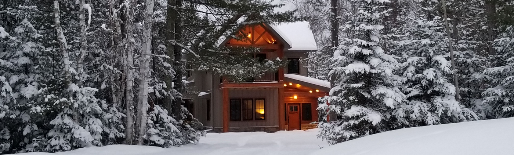

 
<h2 align=center>Hi! I'm Mark Biegert</h2>
<h3 align=center>Electrical engineer currently working on data science with respect to batteries and sensor circuits</h3>
 

## My interests:

* Batteries
* Circuits
* Military history
* Personal finance
* Woodworking

## Connect with me:

## Recent blog posts: 

<!--
**ziggle/ziggle** is a ✨ _special_ ✨ repository because its `README.md` (this file) appears on your GitHub profile.

Here are some ideas to get you started:

- 🔭 I’m currently working on ...
- 🌱 I’m currently learning ...
- 👯 I’m looking to collaborate on ...
- 🤔 I’m looking for help with ...
- 💬 Ask me about ...
- 📫 How to reach me: ...
- 😄 Pronouns: ...
- ⚡ Fun fact: ...
-->
